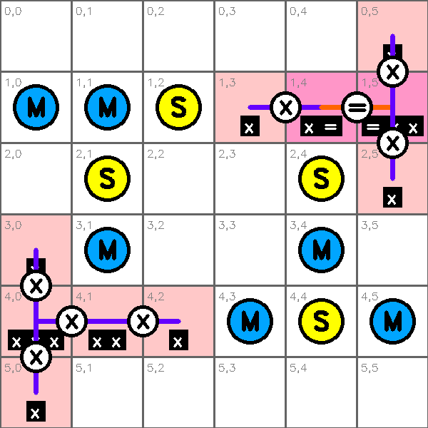
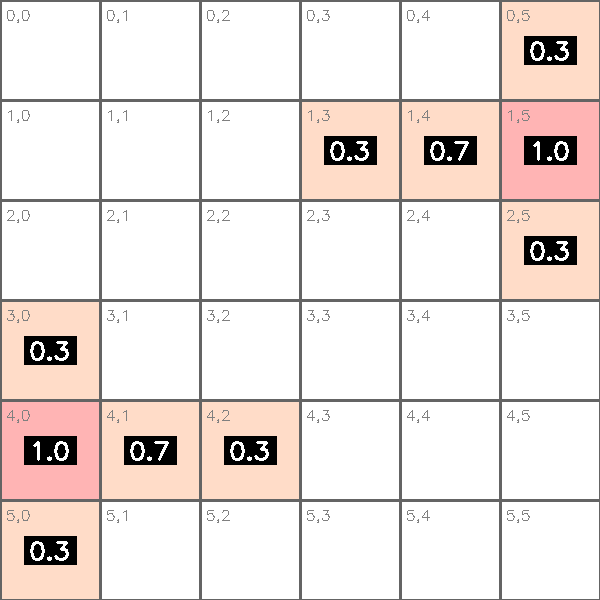
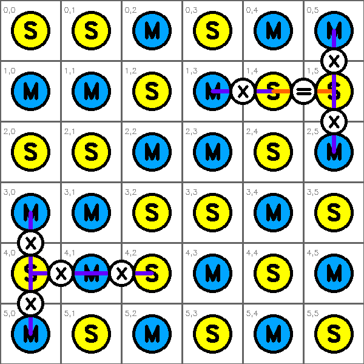
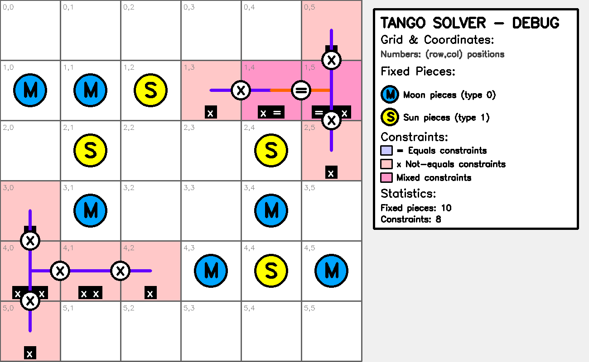
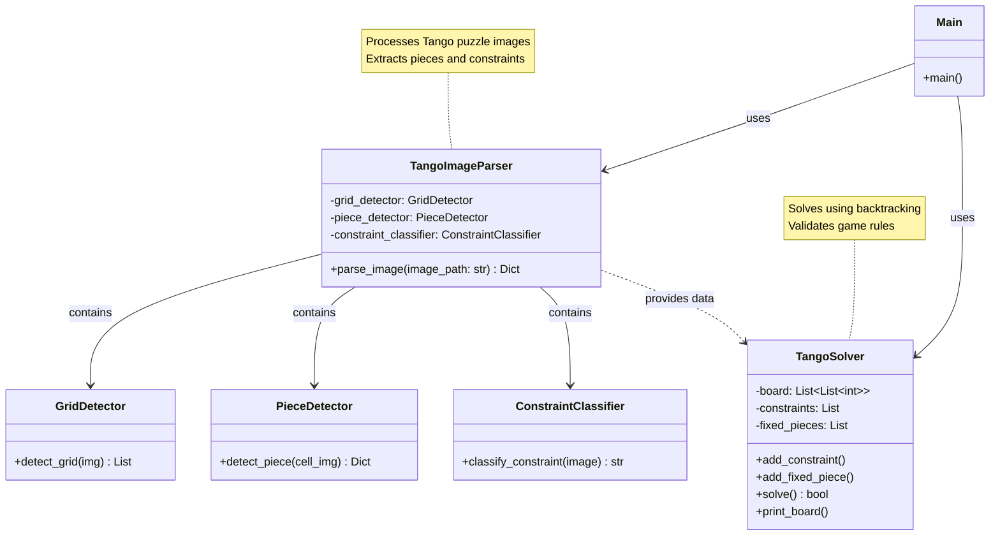

# 🌙🟠 Tango Solver

Computer vision system for automatically solving Tango puzzles from images using OpenCV and constraint satisfaction algorithms.

## 🎯 What is Tango?

Tango is a LinkedIn logic puzzle where you fill a 6x6 grid with moon (🌙) and sun (🟠) pieces following constraints:
- **Fixed pieces**: Some cells have predetermined pieces
- **Equality constraints**: Connected cells must have the same piece type
- **Inequality constraints**: Connected cells must have different piece types
- **Balance rule**: Each row and column should have equal numbers of moons and suns

## ✨ Features

- Automatic grid and piece detection from images
- Constraint detection through visual pattern recognition
- Backtracking algorithm with constraint propagation
- Visual debugging and solution visualization

### Example Puzzle


*Example of a Tango puzzle - Initial board state with fixed pieces and constraints*

### Visual Debug Output

The system generates comprehensive debugging visualizations when running tests with the `--visual` flag:

```bash
python3 -m tests.test_runner examples/sample5.png --visual
```

This generates the following debug images in `tests/img/`:



*Grid detection analysis - Shows detected pieces, constraints, and cell boundaries*



*Constraint density heatmap - Visualizes constraint distribution across the grid*



*Solution visualization - The final solved puzzle with constraints overlay*



*Complete debug view - Combined analysis with statistics and legend*

## 🚀 Installation & Usage

1. **Clone the repository:**
```bash
git clone git@github.com:santipvz/tango_solver.git
cd tango_solver
```

2. **Install dependencies:**
```bash
pip install -r requirements.txt
```

3. **Solve a puzzle:**
```bash
python3 main.py examples/sample1.png
```

**Use your own puzzle image:**
```bash
python3 main.py path/to/your/puzzle.png
```

### Options

```bash
python3 main.py examples/sample1.png --verbose    # Detailed output
python3 main.py examples/sample1.png --no-solve   # Extract info only
```

### Tests

```bash
python3 -m tests.test_runner           # Run all tests
python3 -m tests.test_runner --visual  # With debug images (saves to tests/img/)

# Test with specific image and generate visualizations:
python3 -m tests.test_runner examples/sample5.png --visual

# Test with your own image:
python3 -m tests.test_runner path/to/your/puzzle.png --visual
```

## 🛠️ Architecture

- **`main.py`**: Command-line interface
- **`src/image_parser.py`**: Image processing and feature extraction
- **`src/tango_solver.py`**: Constraint satisfaction solver
- **`tests/`**: Comprehensive test suite with visual debugging


## 📋 Requirements

- Python 3.8+
- OpenCV 4.0+
- NumPy, Pillow, Matplotlib
