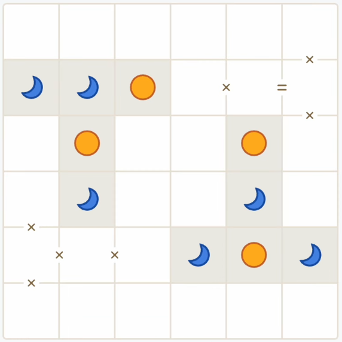
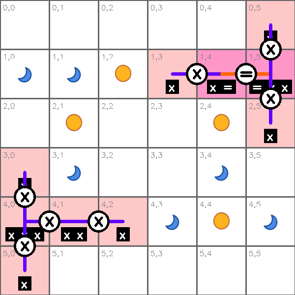
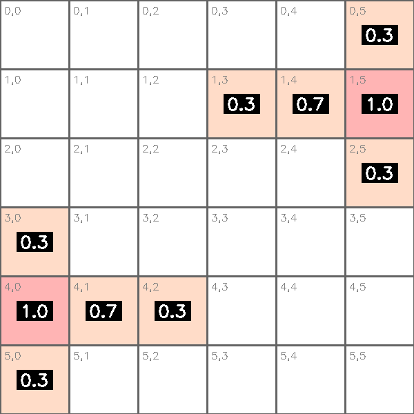
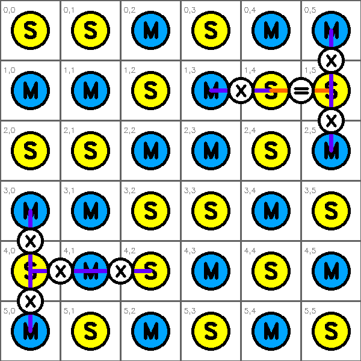
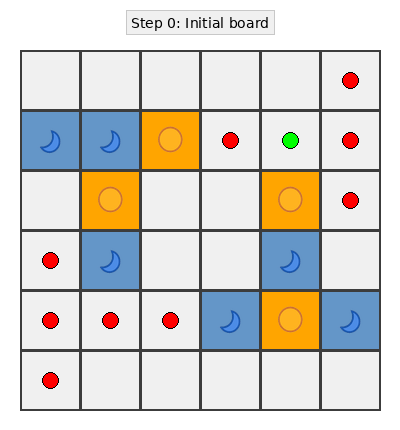
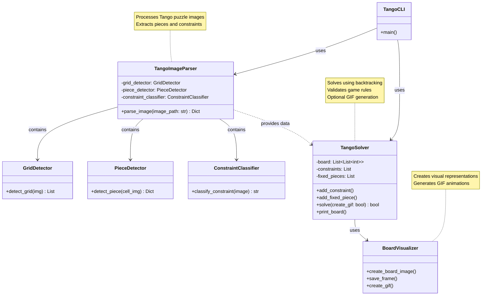

# 🌙🟠 Tango Solver

Computer vision system for automatically solving Tango puzzles from images using OpenCV and constraint satisfaction algorithms.

## 🎯 What is Tango?

Tango is a LinkedIn logic puzzle where you fill a 6x6 grid with moon (🌙) and sun (🟠) pieces following constraints:
- **Fixed pieces**: Some cells have predetermined pieces
- **Equality constraints**: Connected cells must have the same piece type
- **Inequality constraints**: Connected cells must have different piece types
- **Balance rule**: Each row and column should have equal numbers of moons and suns

## ✨ Features

- Automatic grid and piece detection from images
- Constraint detection through visual pattern recognition
- Backtracking algorithm with constraint propagation
- Visual debugging and solution visualization
- GIF animation: Step-by-step visualization of the backtracking algorithm (⚠️ significantly slower execution)

## 🚀 Installation & Usage

1. **Clone the repository:**
```bash
git clone git@github.com:santipvz/tango_solver.git
cd tango_solver
```

2. **Install dependencies:**
```bash
pip install -r requirements.txt
```

3. **Solve a puzzle:**
```bash
python3 main.py examples/sample1.png
```

**Use your own puzzle image:**
```bash
python3 main.py path/to/your/puzzle.png
```

### Options

```bash
python3 main.py examples/sample1.png --verbose    # Detailed output
python3 main.py examples/sample1.png --gif       # Generate GIF animation (⚠️ much slower)
python3 main.py examples/sample1.png --quiet     # Minimal output
```

**Example:**
```bash
python3 main.py examples/sample5.png --verbose
```
<video controls src="assets/test.mp4" title="Title"></video>
### GIF Animation

You can generate an animated GIF showing how the backtracking algorithm explores the solution space:

```bash
# Generate GIF with default settings (1 ms default speed)
python3 main.py examples/sample1.png --gif

# Custom GIF speed and output filename
python3 main.py examples/sample1.png --gif --speed 500 --output my_solution.gif
```

⚠️ **Warning**: Generating the GIF animation significantly slows down the solving process as it captures and saves each step of the backtracking algorithm.

The GIF visualization shows:
- Yellow highlights: current position being processed
- Green dots: equality constraints (=)
- Red dots: difference constraints (x)
- Blue cells: piece type 0
- Orange cells: piece type 1

### Tests

```bash
python -m tests.test_runner           # Run all tests
python -m tests.test_runner --visual  # With debug images (saves to tests/img/)

# Test with specific image and generate visualizations:
python -m tests.test_runner examples/sample5.png --visual

# Test with your own image:
python -m tests.test_runner path/to/your/puzzle.png --visual

# Test with GIF generation:
python -m tests.test_runner examples/sample1.png --gif
```

### Example Puzzle



*Example of a Tango puzzle - Initial board state with fixed pieces and constraints*

### Visual Debug Output

The system generates comprehensive debugging visualizations when running tests with the `--visual` flag:

```bash
python -m tests.test_runner examples/sample5.png --visual
```

This generates the following debug images in `tests/img/`:



*Grid detection analysis - Shows detected pieces, constraints, and cell boundaries*



*Constraint density heatmap - Visualizes constraint distribution across the grid*



*Solution visualization - The final solved puzzle with constraints overlay*


*Complete debug view - Combined analysis with statistics and legend*



*Animated representation of the backtracking algorithm in action*


## 🛠️ Architecture

- **`main.py`**: Command-line interface
- **`src/image_parser.py`**: Image processing and feature extraction
- **`src/tango_solver.py`**: Constraint satisfaction solver with optional GIF generation
- **`src/visualizer.py`**: Board visualization and GIF animation creation
- **`tests/`**: Comprehensive test suite with visual debugging


## 📋 Requirements

- Python 3.8+
- OpenCV 4.0+
- NumPy, Pillow, Matplotlib
