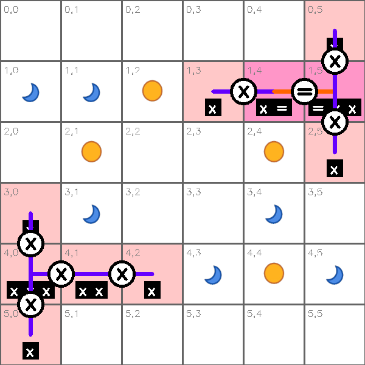
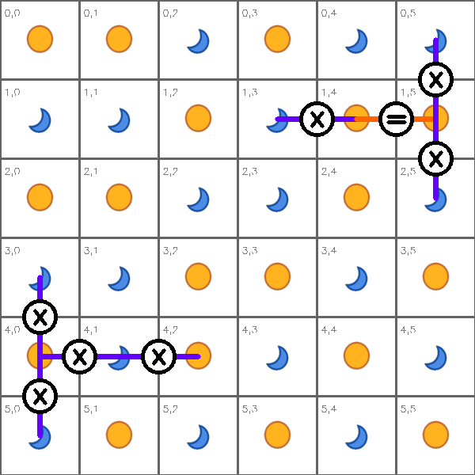
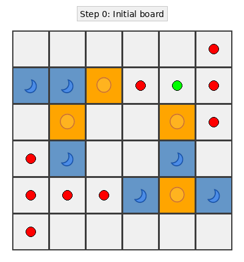
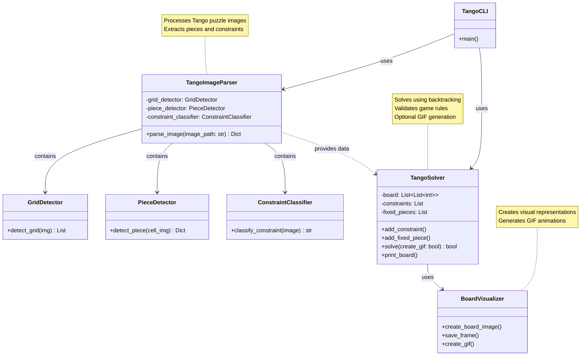

# 🌙🟠 Tango Solver

Computer vision system for automatically solving Tango puzzles from images using OpenCV and constraint satisfaction algorithms.

## 🯠What is Tango?

Tango is a LinkedIn logic puzzle where you fill a 6x6 grid with moon (🌙) and sun (🟠) pieces following constraints:
- **Fixed pieces**: Some cells have predetermined pieces
- **Equality constraints**: Connected cells must have the same piece type
- **Inequality constraints**: Connected cells must have different piece types
- **Balance rule**: Each row and column should have equal numbers of moons and suns

## ✨ Features

- Automatic grid and piece detection from images
- Constraint detection through visual pattern recognition
- Backtracking algorithm with constraint propagation
- Visual debugging and solution visualization
- GIF animation: Step-by-step visualization of the backtracking algorithm (âš ï¸ significantly slower execution)

## 🚀 Installation & Usage

1. **Clone the repository:**
```bash
git clone git@github.com:santipvz/tango_solver.git
cd tango_solver
```

2. **Install dependencies:**
```bash
pip install -r requirements.txt
```

3. **Solve a puzzle:**
```bash
python3 main.py examples/sample1.png
```

**Use your own puzzle image:**
```bash
python3 main.py path/to/your/puzzle.png
```

### Options

```bash
python3 main.py examples/sample1.png --verbose    # Detailed output
python3 main.py examples/sample1.png --gif       # Generate GIF animation (âš ï¸ much slower)
python3 main.py examples/sample1.png --quiet     # Minimal output
```

**Example:**
```bash
python3 main.py examples/sample5.png --verbose
```


### GIF Animation

You can generate an animated GIF showing how the backtracking algorithm explores the solution space:

```bash
# Generate GIF with default settings (1 ms default speed)
python3 main.py examples/sample1.png --gif

# Custom GIF speed and output filename
python3 main.py examples/sample1.png --gif --speed 500 --output my_solution.gif
```

âš ï¸ **Warning**: Generating the GIF animation significantly slows down the solving process as it captures and saves each step of the backtracking algorithm.

The GIF visualization shows:
- Yellow highlights: current position being processed
- Green dots: equality constraints (=)
- Red dots: difference constraints (x)
- Blue cells: piece type 0
- Orange cells: piece type 1

### Tests

```bash
python -m tests.test_runner           # Run all tests
python -m tests.test_runner --visual  # With debug images (saves to tests/img/)

# Test with specific image and generate visualizations:
python -m tests.test_runner examples/sample5.png --visual

# Test with your own image:
python -m tests.test_runner path/to/your/puzzle.png --visual

# Test with GIF generation:
python -m tests.test_runner examples/sample1.png --gif
```

### Example Puzzle


*Example of a Tango puzzle - Initial board state with fixed pieces and constraints*

### Visual Debug Output

The system generates comprehensive debugging visualizations when running tests with the `--visual` flag:

```bash
python -m tests.test_runner examples/sample5.png --visual
```

This generates the following debug images in `tests/img/`:



*Grid detection analysis - Shows detected pieces, constraints, and cell boundaries*


*Constraint density heatmap - Visualizes constraint distribution across the grid*



*Solution visualization - The final solved puzzle with constraints overlay*


*Complete debug view - Combined analysis with statistics and legend*



*Animated representation of the backtracking algorithm in action*


## âš ï¸ Important: Image Quality Requirements

**It is crucial that the puzzle image is cropped as tightly as possible to the board area.** The presence of irrelevant information around the board can cause errors in constraint and fixed piece detection.

### Comparative Example

The following shows the same board captured in two different ways:

#### ✅ Correct Image (Cropped to board)


```
🯠TANGO SOLVER
========================================
ğŸ–¼ï¸  Parsing puzzle from: assets/right.png
✅ Found 10 fixed pieces
✅ Found 4 constraints
🔒 Fixed pieces:
   (0, 2): 1
   (0, 3): 0
   (2, 0): 1
   (2, 3): 1
   (2, 5): 1
   (3, 0): 1
   (3, 2): 0
   (3, 5): 0
   (5, 2): 0
   (5, 3): 1
🔗 Constraints:
   (1, 4) x (1, 5)
   (4, 0) x (4, 1)
   (0, 1) = (1, 1)
   (4, 4) = (5, 4)
✅ Puzzle solved!
📊 Steps: 212

🉠Final solved board:
🌙 🟠 🟠 🌙 🟠 🌙
🌙 🟠 🟠 🌙 🟠 🌙
🟠 🌙 🌙 🟠 🌙 🟠
🟠 🌙 🌙 🟠 🟠 🌙
🌙 🟠 🟠 🌙 🌙 🟠
🟠 🌙 🌙 🟠 🌙 🟠
```

#### ⌠Incorrect Image (With irrelevant information)


```
🯠TANGO SOLVER
========================================
ğŸ–¼ï¸  Parsing puzzle from: assets/wrong.png
✅ Found 11 fixed pieces
✅ Found 1 constraints
🔒 Fixed pieces:
   (0, 2): 1
   (2, 0): 1
   (2, 1): 1
   (2, 3): 1
   (2, 4): 1
   (2, 5): 1
   (3, 0): 1
   (3, 1): 1
   (3, 2): 0
   (5, 2): 0
   (5, 3): 1
🔗 Constraints:
   (4, 4) = (5, 4)
⌠No solution found
Final board state:
⬜ ⬜ 🟠 ⬜ ⬜ ⬜
⬜ ⬜ ⬜ ⬜ ⬜ ⬜
🟠 🟠 ⬜ 🟠 🟠 🟠
🟠 🟠 🌙 ⬜ ⬜ ⬜
⬜ ⬜ ⬜ ⬜ ⬜ ⬜
⬜ ⬜ 🌙 🟠 ⬜ ⬜
```

As can be observed:
- **Correct image**: Detected 10 fixed pieces and 4 constraints.
- **Incorrect image**: Detected 11 fixed pieces and only 1 constraint → **⌠No solution found**

The difference in constraint detection (4 vs 1) is critical and causes the same board to be unsolvable when the image contains irrelevant information.


## ğŸ› ï¸ Architecture

- **`main.py`**: Command-line interface
- **`src/image_parser.py`**: Image processing and feature extraction
- **`src/tango_solver.py`**: Constraint satisfaction solver with optional GIF generation
- **`src/visualizer.py`**: Board visualization and GIF animation creation
- **`tests/`**: Comprehensive test suite with visual debugging


```mermaid
classDiagram
direction TB
    class TangoCLI {
        +main()
    }
    class TangoImageParser {
        -grid_detector: GridDetector
        -piece_detector: PieceDetector
        -constraint_classifier: ConstraintClassifier
        +parse_image(image_path: str) Dict
    }
    class TangoSolver {
        -board: List~List~int~~
        -constraints: List
        -fixed_pieces: List
        +add_constraint()
        +add_fixed_piece()
        +solve(create_gif: bool) bool
        +print_board()
    }
    class BoardVisualizer {
        +create_board_image()
        +save_frame()
        +create_gif()
    }
    class GridDetector {
        +detect_grid(img) List
    }
    class PieceDetector {
        +detect_piece(cell_img) Dict
    }
    class ConstraintClassifier {
        +classify_constraint(image) str
    }
    note for TangoImageParser "Processes Tango puzzle images<br/>Extracts pieces and constraints"
    note for TangoSolver "Solves using backtracking<br/>Validates game rules<br/>Optional GIF generation"
    note for BoardVisualizer "Creates visual representations<br/>Generates GIF animations"
    TangoCLI --> TangoImageParser : uses
    TangoCLI --> TangoSolver : uses
    TangoSolver --> BoardVisualizer : uses
    TangoImageParser --> GridDetector : contains
    TangoImageParser --> PieceDetector : contains
    TangoImageParser --> ConstraintClassifier : contains
    TangoImageParser ..> TangoSolver : provides data
```
## 📋 Requirements

- Python 3.8+
- OpenCV 4.0+
- NumPy, Pillow, Matplotlib
